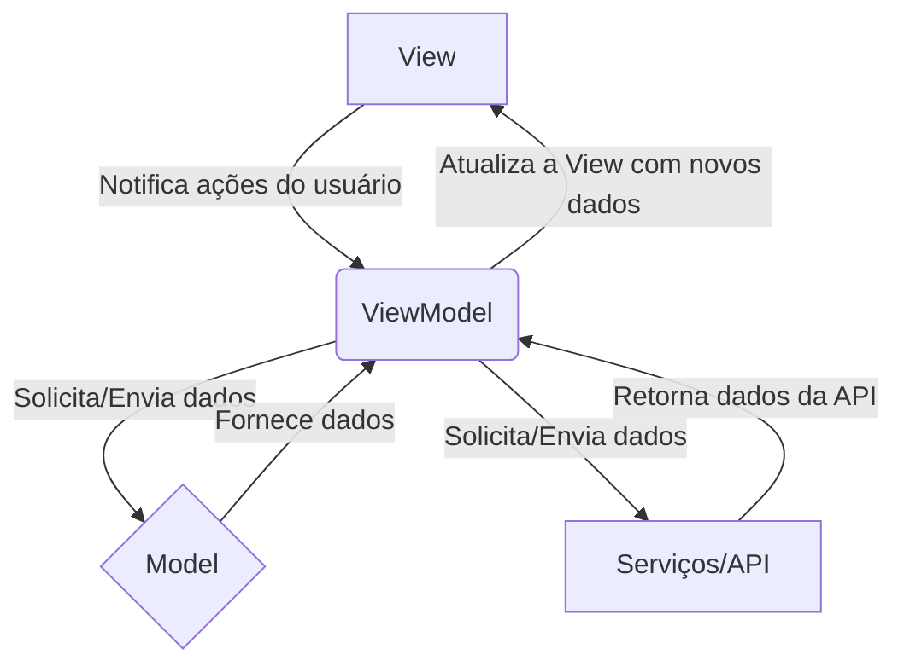

# PokéExplorer

Bem-vindo ao PokéExplorer, sua jornada definitiva para descobrir, colecionar e acompanhar seus Pokémon favoritos! Este projeto foi desenvolvido como avaliação final para a disciplina de **Desenvolvimento Mobile: IOS**, do 5º período do curso de **Sistemas de Informação**.

**Desenvolvido por:** *Juan Rodrigues dos Santos Servelo e João Victor Monteiro Tancon*

---

## ❯ Índice

* [Descrição Geral](#-descrição-geral)
* [Vídeo de Demonstração](#-vídeo-de-demonstração)
* [Funcionalidades](#-funcionalidades)
* [Tecnologias Utilizadas](#-tecnologias-utilizadas)
* [Arquitetura MVVM](#-arquitetura-mvvm)
* [Detalhes da Implementação](#-detalhes-da-implementação)
    * [Consumo da API](#consumo-da-api-pokéapi)
    * [Persistência com SwiftData](#persistência-de-dados-com-swiftdata)
    * [Design Tokens](#design-tokens)
    * [Item de Criatividade: Paginação](#item-de-criatividade-paginação)
* [Como Executar o Projeto](#-como-executar-o-projeto)

---

## ❯ Descrição Geral

O **PokéExplorer** é um aplicativo iOS que permite aos usuários mergulhar no vasto universo Pokémon. Com ele, é possível navegar por uma lista infinita de Pokémon, visualizar informações detalhadas de cada um, criar uma conta de usuário e gerenciar uma lista pessoal de favoritos. O app foi construído utilizando as tecnologias mais modernas do ecossistema Apple, com foco em boas práticas de arquitetura e uma experiência de usuário fluida e agradável.

---

## ❯ Vídeo de Demonstração

Assista a um vídeo demonstrando todas as funcionalidades do aplicativo, incluindo a responsividade do layout em diferentes dispositivos e orientações.

**[>> Link para o Vídeo no YouTube <<]([https://www.youtube.com/](https://youtu.be/DKrLVWcSqjM))**

---

## ✨ Funcionalidades

* **Autenticação de Usuário:** Sistema completo de cadastro e login.
* **Lista Infinita de Pokémon:** Navegue por centenas de Pokémon com carregamento sob demanda (paginação).
* **Detalhes do Pokémon:** Visualize informações completas, como tipo, altura, peso e habilidades.
* **Sistema de Favoritos:** Salve seus Pokémon preferidos em uma lista pessoal, vinculada à sua conta.
* **Gerenciamento de Perfil:** Altere seu nome de usuário e senha.
* **Layout Responsivo:** Interface adaptável para diferentes tamanhos de iPhone e iPad, nas orientações retrato e paisagem.
* **Animações:** Interações e transições suaves para uma experiência mais rica.

---

## 🛠️ Tecnologias Utilizadas

* **Linguagem:** **Swift 5**
* **Framework UI:** **SwiftUI**
* **Gerenciamento de Estado:** **Combine** e **ObservableObject**
* **Arquitetura:** **MVVM (Model-View-ViewModel)**
* **Persistência de Dados:** **SwiftData**
* **API:** **PokéAPI (REST)**

---

## 🏗️ Arquitetura MVVM

O projeto foi estruturado seguindo o padrão de arquitetura **Model-View-ViewModel (MVVM)**, visando uma clara separação de responsabilidades, maior testabilidade e manutenibilidade do código.

* **Model:** Representa os dados da aplicação. No PokéExplorer, são as `structs` como `Pokemon` e as classes `@Model` do SwiftData, como `Usuario` e `Favorito`.
* **View:** A camada de interface do usuário, responsável por exibir os dados e capturar as interações. Construída inteiramente com SwiftUI (ex: `PokemonListScreen`, `LoginView`).
* **ViewModel:** Atua como um intermediário, contendo a lógica de apresentação e de negócios. Ele prepara os dados do Model para serem exibidos pela View e reage às interações do usuário (ex: `PokemonListViewModel`, `LoginViewModel`).



---

## ⚙️ Detalhes da Implementação

### Consumo da API (PokéAPI)

* **Justificativa da Escolha:** A **PokéAPI** ([https://pokeapi.co/](https://pokeapi.co/)) foi escolhida por ser uma API REST pública, gratuita, extremamente bem documentada e com uma vasta quantidade de dados sobre o universo Pokémon, o que a torna ideal para este projeto.
* **Implementação:** A comunicação com a API é encapsulada na classe `PokeAPIService`. Esta classe é responsável por montar as URLs, fazer as requisições HTTP (`URLSession`) e decodificar as respostas JSON para os nossos `Models`.
* **Endpoints e Dados:**
    * `pokemon?limit={limit}&offset={offset}`: Usado para a lista paginada de Pokémon.
    * `pokemon/{id}`: Usado para obter os detalhes de um Pokémon específico.
    * **Dados principais:** ID, nome, imagem, tipo(s), peso, altura e habilidades.

### Persistência de Dados com SwiftData

* **Justificativa da Escolha:** **SwiftData** foi escolhido por ser o framework de persistência mais moderno da Apple, com integração nativa e simplificada com SwiftUI, utilizando macros e uma API declarativa.
* **Modelos de Dados:**
    * `Usuario`: Armazena as informações de conta do usuário (`id`, `nomeDeUsuario`, `email`, `senha`).
    * `Favorito`: Armazena os Pokémon favoritados, vinculando um `pokemonId` ao `usuarioEmail` para garantir que cada usuário tenha sua própria lista.
* **Autenticação e Persistência:**
    * **Cadastro:** Um novo objeto `Usuario` é criado e inserido no `ModelContext`.
    * **Login:** É feita uma busca (`FetchDescriptor`) no banco de dados pelo usuário com o e-mail fornecido para validar a senha.
    * **Favoritos:** A adição ou remoção de um favorito simplesmente insere ou deleta um objeto `Favorito` do `ModelContext`.

### Design Tokens

Para garantir consistência visual e facilitar a manutenção, foram definidos **Design Tokens**.

* **Implementação:** Os tokens para cores e fontes foram centralizados em um `enum` chamado `DesignTokens` no arquivo `DesignTokens.swift`.

    ```swift
    // Exemplo da definição dos tokens
    enum DesignTokens {
        enum Colors {
            static let primary = Color.red
            // ...
        }

        enum Fonts {
            static let title = Font.system(size: 24, weight: .bold)
            // ...
        }
    }
    ```
* **Utilização:** Esses tokens são referenciados em toda a aplicação para estilizar os componentes de UI.

    ```swift
    // Exemplo de uso em uma View
    Text("PokéExplorer")
        .font(DesignTokens.Fonts.title)
        .foregroundColor(DesignTokens.Colors.primary)
    ```

### Item de Criatividade: Paginação

* **Funcionalidade:** Para otimizar o desempenho e evitar sobrecarregar a API, foi implementada a **paginação** (ou "scroll infinito") na lista de Pokémon.
* **Implementação:**
    1.  O `PokeAPIService` foi adaptado para aceitar parâmetros `limit` e `offset` em suas requisições.
    2.  O `PokemonListViewModel` gerencia o `offset` atual e uma flag para controlar se ainda há mais páginas a serem carregadas.
    3.  Na `PokemonListScreen`, um gatilho `.onAppear` no último item da lista solicita ao ViewModel que carregue a próxima página de resultados, que são então adicionados à lista existente.

---

### 📦 Bibliotecas de Terceiros

Este projeto foi desenvolvido utilizando exclusivamente frameworks nativos da Apple (SwiftUI, SwiftData, Combine, Foundation). **Nenhuma biblioteca de terceiros foi utilizada.**

---

## 🚀 Como Executar o Projeto

1.  Clone este repositório: `git clone [URL_DO_SEU_REPOSITORIO]`
2.  Abra o arquivo `PokéExplorer.xcodeproj` no Xcode (versão 15 ou superior).
3.  Selecione um simulador de iPhone ou iPad.
4.  Pressione `Cmd + R` para compilar e executar o aplicativo.
